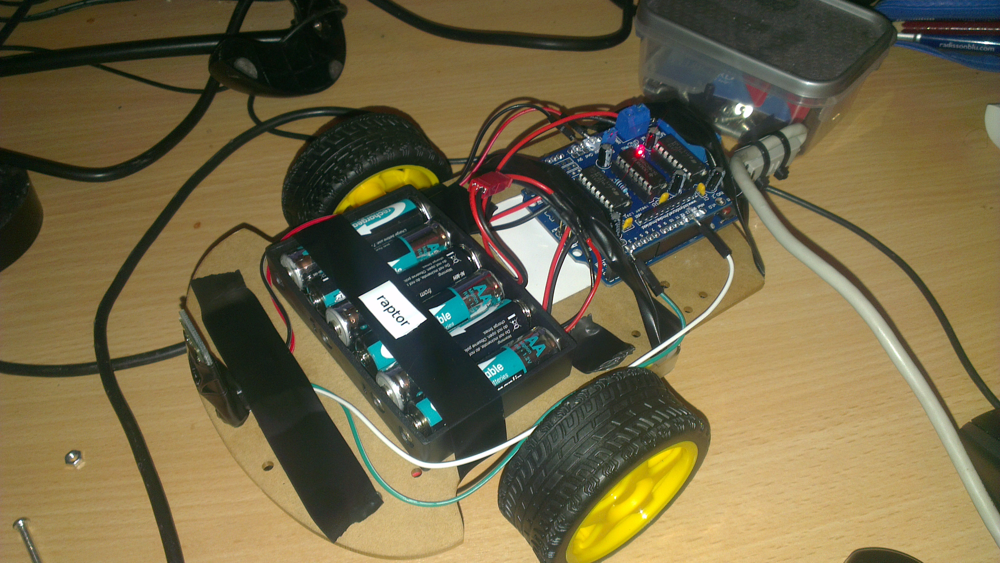

dinobots
========

I make open source robots named after dinosaurs. Hey, everyone needs a hobby.

## Rex ##

4 motor tank-like chassis.

- Arduino Uno
- L298N (HBridge)

## Raptor ##

2 motor rover-like chassis.

### Version 2 (c. 2017-now)

- **Controller**: [Wemos R1 D2 v2.3](https://tasmota.github.io/docs/devices/Wemos-D1-R1-%26-R2/), connecting to WiFi, exposing a TCP server on port 80
- **H-Bridge**: [Adafruit Motor Shield v2](https://learn.adafruit.com/adafruit-motor-shield-v2-for-arduino)

### Version 1 (c. 2013-2017)
- **Controller**: Arduino Uno, using Software Serial, connected to a Serial-to-Bluetooth adaptor
- **H-Bridge**: [Adafruit Motor Shield v1](http://learn.adafruit.com/adafruit-motor-shield/overview)

